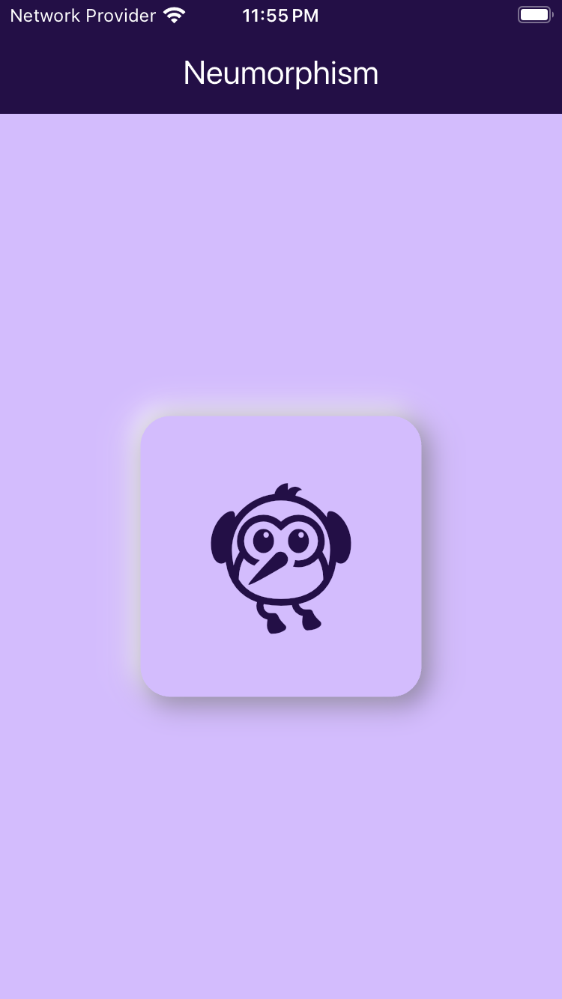

# Flutter Neumorphism UI Demo

This is a simple Flutter project demonstrating the **Neumorphism** design pattern, where UI components have soft, extruded, or inset shadows that give a subtle, 3D effect. The project is built using Flutter's `Material3` design, which enhances the overall look and feel with modern UI features.

## Features

- **Neumorphism Design:** Using soft shadows and light to create a 3D look.
- **Material 3 UI:** Making use of the modern Material design system.
- **Responsive UI:** Automatically adjusts according to screen size.

## Screenshots



## Getting Started

To run this project locally, follow the steps below:

### Prerequisites

- Install [Flutter SDK](https://flutter.dev/docs/get-started/install)
- Install a suitable IDE such as [VS Code](https://code.visualstudio.com/) or [Android Studio](https://developer.android.com/studio)

### Clone the Repository

```bash
git clone https://github.com/Keshav-15/flutter-5_neumorphism.git
```
